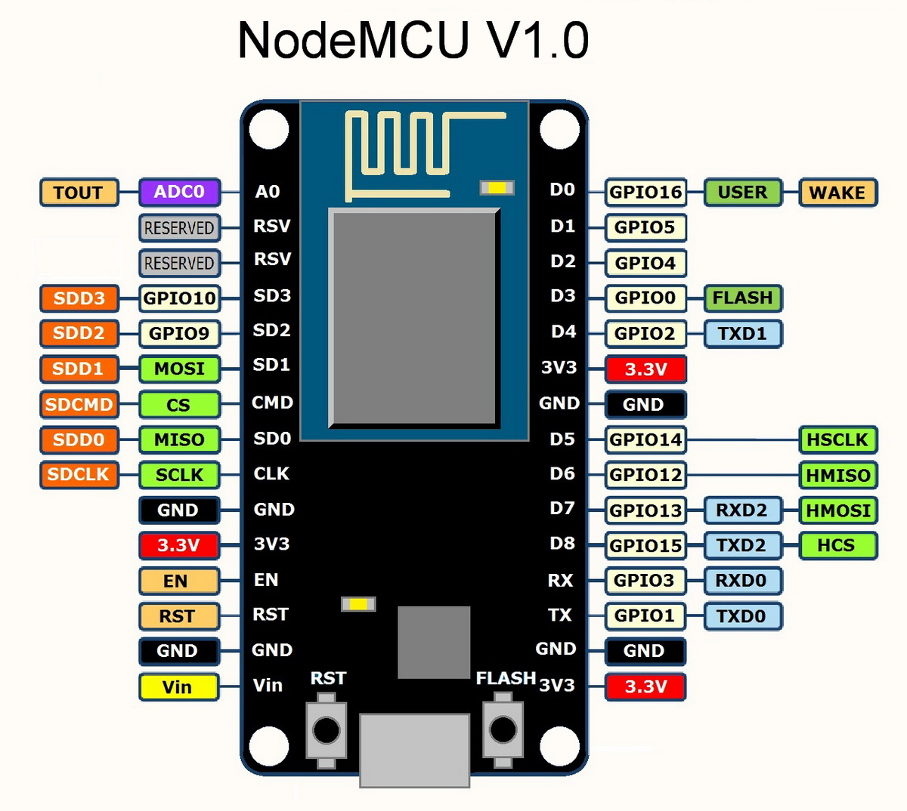
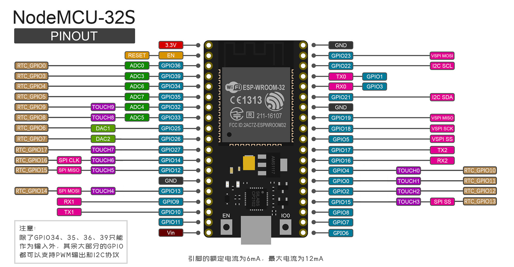

# Espressify - ESPHome

Visit [ESPHome](https://www.esphome.io/)  ✈

## Setup

Install `esphome` by `Conda`.

```shell
# create the `esphome` conda environment
conda create -n esphome python=3.9

# activate the `esphome` conda environment
conda activate esphome

# install esphome 
pip3 install esphome
```

## Run

1. create `board/secrets.yaml` file

```text
# WiFi
wifi_ssid: "ssid"
wifi_password: "hard-to-guess"
wifi_ap_password: "hard-to-guess"

# Home Assistant API
api_encryption_key: "hard-to-guess"

# OTA
ota_password: "hard-to-guess"
```

2. build and deploy

```shell
esphome \
  -s name esphome \
  -s fullname ESPHome \
  -s board nodemcu \
  run example.yaml
```

## Examples

## References

### Pin Map

- NodeMCU 8266



- NodeMCU 32


